 # SMART THERMOSTAT INDOOR TEMPERATURE PREDICTION
 
 

 # Introduction

Smart Thermostat is a company that guarantees 15% annual savings and tenant comfort with our unique boiler monitoring and management system from the ground up that controls and monitors boilers and heating systems end-to-end. We built the most advanced physical controls (heat computers and sensors) on the market, and paired them with machine learning software that communicates and automatically manages the controls. 

 

We designed our heat control and sensor network from the ground up to use apartment temperature and boiler performance data thousands of times a second to control the boiler more effectively. The result is lower fuel usage, better quality of heat for tenants, and lower boiler service costs.

Machine learning software that automatically calibrates the control, by learning from each building individually. We are the first heating management service to use machine learning to automatically calibrate and adjust the settings for each building, based on that building's past performance, and the upcoming weather forecast that day. The result is an additional 5% reduction in heating costs, and an improvement in tenant comfort.

 # Objectives

* Explore data via visualizations and statistical analysis
        * Distribution of buildings in each state and statistical analysis for each state
        * Difference between commercial and non commercial buildings and their indoor temperature
        * Exploratory data analysis with a single building        
* Apply regression models and select the best fitting
* Apply model to the new data
* Model tuning

* Check data for trends & seasonality and decomposition
* Create a model with selected p,d,q parameters for base model
* Property price predictions for a single zipcode
* Property price predictions for the determined dataset
* Making recommendations based on investment period

 ## Explore data via visualizations and statistical analysis 
 
 
The data is consist of 7 columns and 3,608,749 rows, where each row contains the measurements for one minute from 2020-11-17 20:24:00 to 2020-12-17 20:22:00.

Within the data, following columns are provided.

**building_id** : Numerical type data, used as unique identifier for each building. There are 89 different buildings in the dataset.

**ts** : Unix timestamp.

**outdoor_temp** : Outdoor temperature of the city in Fahrenheit that the building in question is in

**boiler_on** : Binary column that contains boiler on/off information.

**commercial** : Boolean column that answers if the building is commercial or not.

**state** : In which state the building in question is. Company has active systems in NY, MA, and RI.

**indoor_temp** : Indoor temperature of the building in Fahrenheit.

 
 ### Distribution of buildings in each state and statistical analysis for each state
 
 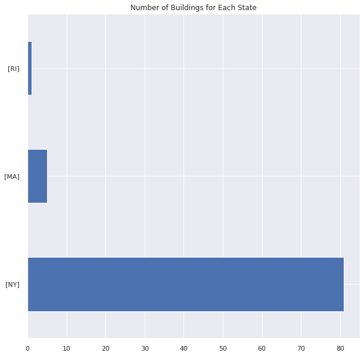

***Observations:***

* The majority of buildings are in New York State. Out of 87, 5 of them are in Massachusetts, and only 1 in Rhode Island.
* Between November 17,2020 and December 17,2020, New York has the highest average outdoor temperature with 47.78 °F while Rhode Island has the lowest average outdoor temperature with 40.53 °F.
* Due to front fill method used in data cleaning step, for the building in Rhode Island, all the boiler on column is 1. When we further investigate, in the initial dataset, this columns was full null, therefore this information is not accurate. We drop this building from our dataset.
* The commercial buildings are located in NY.
* The average indoor temperature is similar for MA and NY. RI has higher indoor temperature.
* Average indoor and outdoor temperature difference seems significantly different for each state. 

 ###  Difference between commercial and non commercial buildings and their indoor temperature
 
  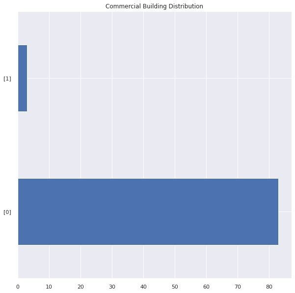
 
***Observations:***

* Out of 86 buildings, only 3 of them are commercial and they all are located in NY.
* Commercial buildings are located where the average outdoor temperature is higher.
* For residential buildings, boiler kept on longer, given the 1 is in the 3rd quartile. (For commercial buildings, it is out of 3rd quartile.)
* Indoor temperature for residential buildings are higher. It is still within the 1st standard deviation of the commercial buildings' indoor temperature.
* Commercial and non-commercial buildings have their differences. We keep forward our analysis with residential buildings.
* For non-commercial buildings, we observe differences for MA and NY. We can drop the buildings in MA for further analysis.
* We drop *state* and *commercial* columns since they have the same value for each datapoint.

 ### The average indoor temperature distibution for each residential building located in New York State
 
  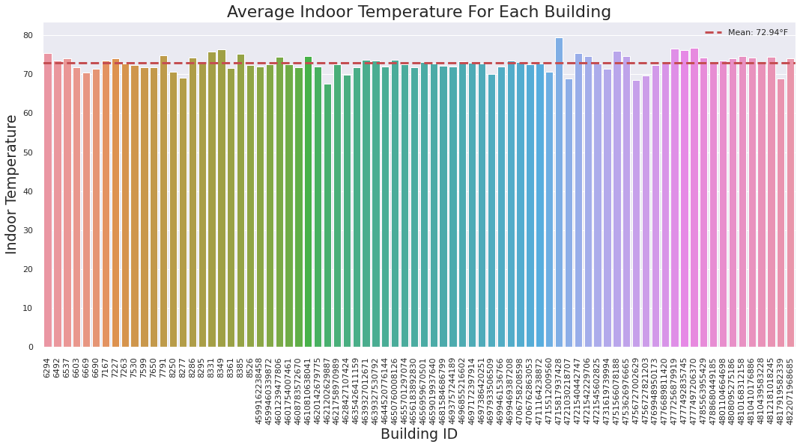

***Observations:***

* Out of 78 non-commercial buildings located in New York State, each building have different average indoor temperature which indicates each building have different boiler on/off settings.
* Average indoor temperature for all the buildings is 72.94 °F, which is in range of optimal room temperature.
* Ideal temperature setting varies for each individual. Biological, environmental, and personal preferences play a big role on ideal temperature selection. 
* If needed for future comparisons and setting choices we can use scientific standard room temperature - 73 °F.

 ### Exploratory data analysis with a single building

  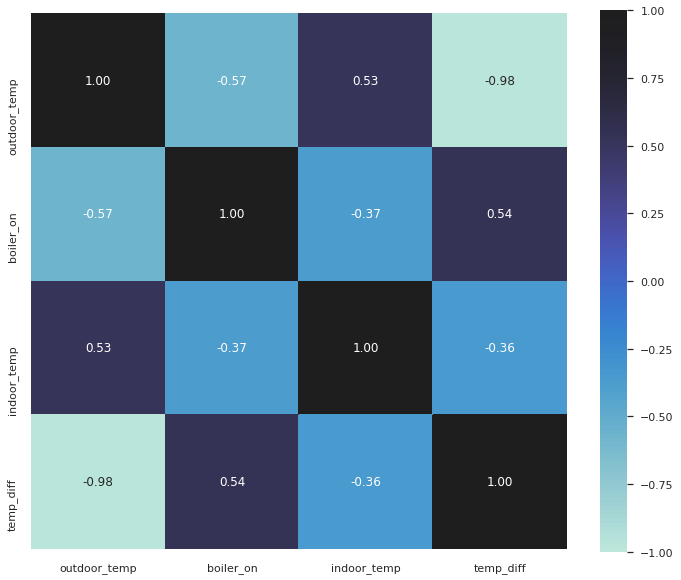

***Observations:***

* Heatmap shows there is no high correlation between variables except temperature difference column which was engineered by subtracting outdoor temperature from indoor temperature.
* Outdoor temperature has a negative correlation with boiler_on column. (-0.57)
* Indoor temperature also has a negative correlation with boiler_on column. (-0.37)
* Indoor temperature and outdoor temperature has a positie correlation of 0.53.

 #### Indoor temperature change over time
 
  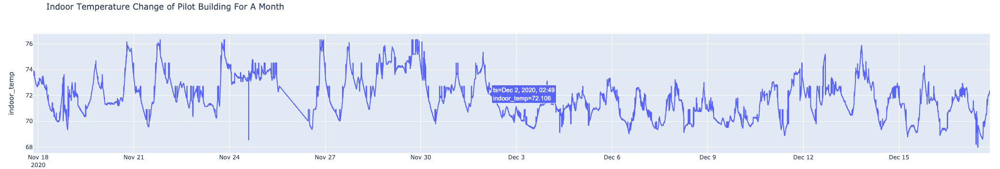
  
 #### Indoor temperature vs boiler setting
 
  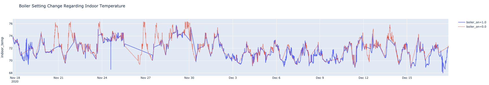
  
 #### Indoor - outdoor temperature change

  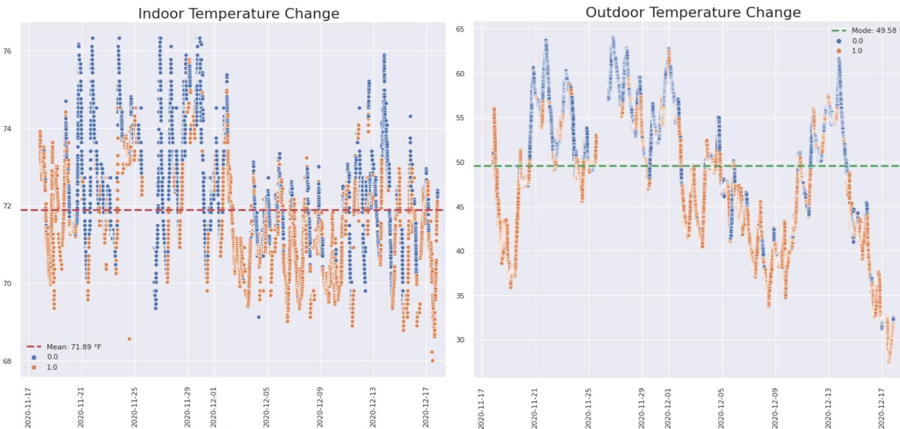
 
 #### Indoor temperature comparison of 2 different days
 
  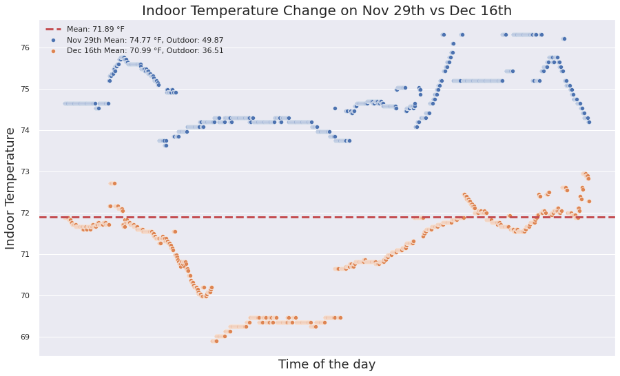
  
***Observations:***

* Indoor temperature changes depending on the ourdoor temperature, time of the day, and boiler on/off setting.

* Heatmap shows there is no high correlation between variables except temperature difference column which was engineered by subtracting outdoor temperature from indoor temperature. Indoor temperature and outdoor temperature has a positie correlation of 0.53. Outdoor and indoor temperatures have negative correlations with boiler_on column. This explains that the boiler goes off when the indoor temperature and outdoor temperature get high and vice versa. 

* When the temperature difference is high, boiler is more likely to be on and vice versa.

* The majority of the time when the boiler is on, we observe that indoor temperature is below average indoor temperature. This indicates when the temperature is higher than a certain temperature, the boiler goes off and when the temperature is below a certan temperature, it turns on to reach the optimal temperature.

* When the outdoor temperature is above mode (48.58 °F), the thermostat goes off. We observe when it is above 55°F, it is more likely to go off. When outdoor temperature is below mode and and indoor temperature is below average, the boiler most likely goes on.

* When comparing 2 different days with the same number of temperature snapshots, we observe different optimal temperatures for each day. Such as for our building, average indoor temperature is 71.89 °F. On November 29th, the average indoor temperature is 74.77 °F while the mode outdoor temperature is 49.87 °F. On December 16th, the average indoor temperature is 70.99 °F while the mode outdoor temperature is 36.51 °F. 

* We see similarity in temperature flactuations on each day around same time of the day.

* Given the different outdoor temperatures, boiler settings change for each day. When it is colder, boiler stays on more often to keep the optimal indoor temperature.

 ## Apply regression models and select the best fitting

We create Univariate and Multivariate Regression Models.
 
  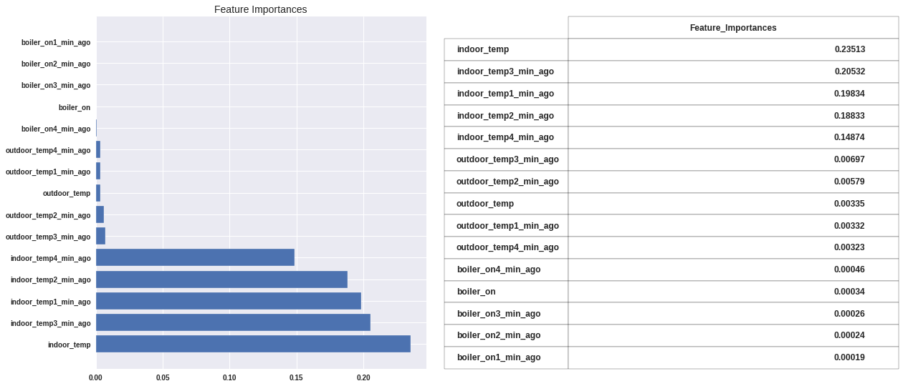

***Observations:***

*   Multivariate regression models have better results compared to univariate regression models regarding MSE value.

*   Top 3 best models with the least MSE:
      * Extra Trees Regression
      * Random Forest Regression
      * Bagging Regressor

*   We observe that majority of the models are significantly effected by the latest indoor temperature.

*   Extra Trees Regression has higher feature importances for outdoor temperature compared to others.

*   Next, we apply Extra Tree Regression to new data and determine if the model is widely applicable.

 ## Apply model to the new data
 
 We test the Extra Trees Regression Model given above to different buildings to decide if this model is applicable to other buildings.
 
 ### CONCLUSION
 
 *   Extra Trees Regressor Model provide the least Mean Squared Error value for for the multivariate regression models. This value is also better than univariate regression models.

*   Our base model has an MSE of 0.031.

*   This model significantly relies on indoor temperatures.

*   We continue analysis by applying the same regression model to the different buildings' data to see how applicable our model is. 

*   We apply this model to 2 different buildings and calculate MSEs of 0.173 and 0.245, which are higher that the base model.

*   This is an indication of that our model is not widely applicable.

*   Later we continue applying the model to all 38 buildings in New York State. For this data, our MSE is 0.8, which is very close to 1.

*   It is safe to say that this model is not widely applicable. 

*   We create a new Extra Regression model and train 38 buildings' data and get an MSE of 0.067.

 ### SUGGESTION
 
* Our model is not widely applicable. Next step can be creating a base model with a random sample data from the all data set instead of using one building's data.

* Our models significantly rely on indoor temperature, especialy the latest indoor temperature value most of the times. (We observed this in the previous notebook.)

* From exploratory data analysis, we observed that indoor temperature doesn't change within 5 minutes time frame most of the time. We can change our target from shifted indoor temperature to indoor temperature difference.

* For the indoor temperature difference model, we can eliminate data where there is no change.

 ## Model tuning
 
We create an indoor temperature difference column by subtracting indoor temperature from shifted indoor temperature(periods=-5). We observe that for more than half of the data there is no indoor temperature change within the next 5th minute. We eliminate the data where there is no change in indoor temperature over the 5 minutes period. This will be our target that we will predict. 
  
 
We apply Decision Trees, Random Forest, Extra Trees, and Gradient Boosting Regressions. Random Forest Regression and Extra Trees Regression provide better MSE values and test scores. We keep tuning the model using Random Forest Regression Model. (We tried both Random Forest and Extra Trees Regressions for modeling and we received better results with Random Forest Tuning even though for the base model Extra Trees Regression performs slightly better.)

  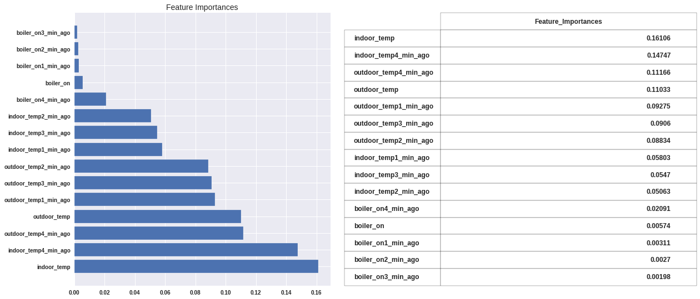

 ### 1. Predicting 5 minute out with differencing periods 1 and 5

  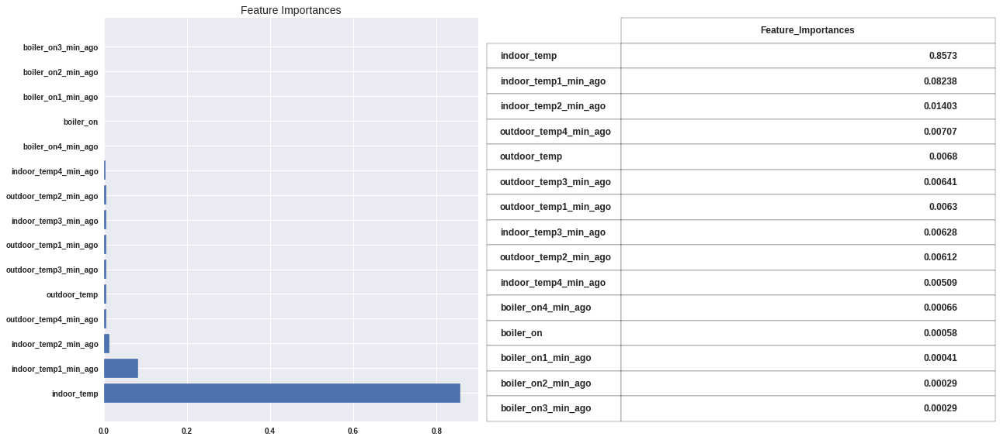
 
* We created a dataset using differencing with period 1 and period 5 to indoor and outdoor temperature columns.
* We applied Random Forest Regression with MinMaxScaler.
* The MSE for period=1 differencing is 0.12005. (Train Score = 0.93, Test Score = 0.529)
* The MSE for period=5 differencing is 0.12897 with higher Train and Test Score. (Train Score = 0.945, Test Score = 0.622)
* The model heavily relies on 4 minutes ago indoor temperature.

 ### 2. Predicting 1 minute out with differencing periods=1

  
 
* We create a new dataset using differencing with period 1.
* We apply Random Forest Regressor with MinMaxScaler.
* The MSE of this model is 0.085.
* It is safe to say our model is doing a good job when predicting the difference between the next minute compared to predicting 5 minutes into the future.
 
 ### 3. Predicting 10 minute out with differencing periods=1
 
  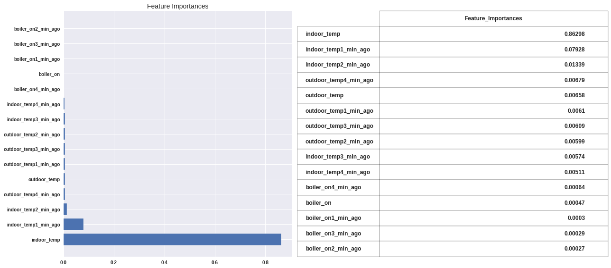
 
* We create a new dataset using differencing with period 1.
* This model is designed to predict temperature difference 10 minutes into the future.

* We apply Random Forest Regressor with MinMaxScaler.

* The MSE is 0.09, Train Score is 0.99 and Test Scoreis 0.92. are the same as Ramdom Forest modeling with differencing 1 and 5 minutes into the future.

* The MSE for predicting 5 minutes into the future is 0.12.

* We observe that predicting the next 10 minute provides better MSE.
 
 ### 4. Predicting 5 minute out with 10 minute predictors with differencing periods=1
 
  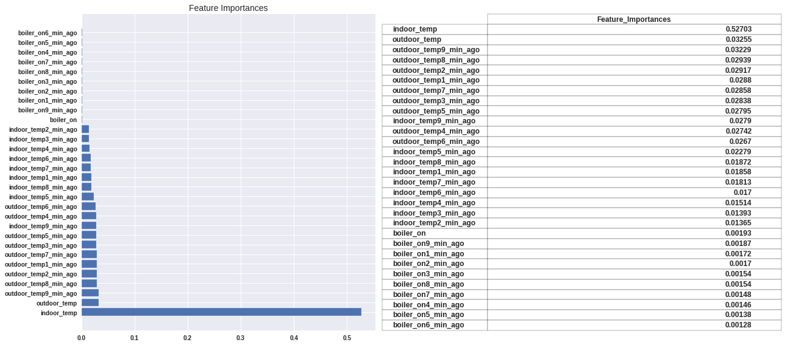

*   We create a new dataset using differencing with period 1 and used 10 minutes of data for each row.

*   This model is designed to predict temperature difference 5 minutes into the future.

*   We apply Random Forest Regressor with MinMaxScaler.

*   The MSE is 2.79, Train Score is 0.93 and Test Score is 0.49.

*   Indoor temperature - 0 minutes ago is significantly effective on the model.

*   5 minute time frame has better results as predictors.
 
 
 ## CONCLUSION
 
  

*   We have been predicting indoor temperature in the next 5th minute. We created fairly accurate models. For model tuning, first we stripped our data where there is no indoor temperature change within the next 5 minutes. 

*   We applied 4 of more prominent regression models including Decision Trees, Random Forest, Extra Trees and Gradient Boosting. Later, we tuned the most promising 2 base models with different parameters. Some base models are more open to improvement. As we observed our Extra Trees Regression Model have better base results compared to Random Forest Regression. We apply different methods for tuning and receive better results with Random Forest Regression.

*   With Random Regressor, we received better results when using MinMaxScaler instead of StandardScaler as our standardization method. All our Random Forest Regressions are standardized with MinMaxScaler. 

*   In all the models, we observe *indoor_temp* columns are the most significant columns, mostly the first and/or the last indoor temperature values. *outdoor_temp* columns are also has a good feature importance at some models. It seems *boiler_on* is the least significant predictor. In practice, it is safe to say it plays a major role on the next indoor temperature value.

*   Below, you see Train-Test Scores and MSE Values for differently tuned models. Our base model is predicting the difference with the next 5th minute using indoor_temp, outdoor_temp and boiler_on columns and their previous 4 minutes' data. (Each row has 5 minutes' data) Our MSE is 0.135. Our goal is to improve this model, and get smaller MSE.

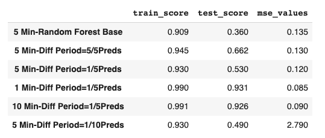

*   **Tuning with Differencing with Periods=5** : We apply differencing to indoor and outdoor temperature columns with periods=5. Our MSE is improved 0.005.

*   **Tuning with Differencing with Periods=1** : We apply differencing to indoor and outdoor temperature columns with periods=1. Our MSE is 0.12. We observe that we receive better results with differencing 1 and will use this in the next models.

*   **Tuning with Differencing with Periods=1 to Predict 1 Minute Out** : In this model, we change our target to predict the indoor temperature difference with the next minute's temperature. We get a MSE of 0.085 which is highly improved compared to the base.

*   **Tuning with Differencing with Periods=1 to Predict 10 Minute Out** : In this model, we change our target to predict the indoor temperature difference with the next 10th minute's temperature. We get a MSE of 0.09. This is an interesting finding. Because the model proved it is better predicting the next model. One would think predicting the next 5th minute will provide better results than predicting the next 10th minute. 

*   **Tuning with Differencing with Periods=1 to Predict 5 Minute Out with 10 Minute Worth of Predictors** : For this model we change the number of predictors. Instead of using 5 minutes worth of data(15 predictors), we use 10 minutes data(30 predictors). This is another interesting result that this model has the worst Mean Squared Error Value. When initiating this model, my Null Hypothesis was reading the last 5 minutes data to predict the next 5th minute's difference will provide better results thatn reading the last 10 minutes data. With this model we prove that we fail to reject the Null Hypothesis.

*   Of all the tuned models, we get the best results with differencing the data with periods=1 using 5 minutes' data as predictors. Both predicting 1 minute and 10 minute out provide prominent results.

 ## SUGGESTION

 
*   We have very limited predictors. We can start feature engineering in order to create better predictors. One feature can be creating a columns where we store how many consecutive minutes the boiler has been on or off. This may improve the level of feature importance of *boiler_on* column. 

*   Another options is checking for non-linearities in the relationship between outdoor temperature and the change in indoor temperature.

*   We observed that temperature does not change from minute to minute very often. So when we are using the previous minutes data, most of the time we have the same values. We can change the frequency of our time series such as 5 minutes(5T). In practice, this will increase the variety in predictor values. 

*   Use TensorFlow to do modeling using Time Series.

